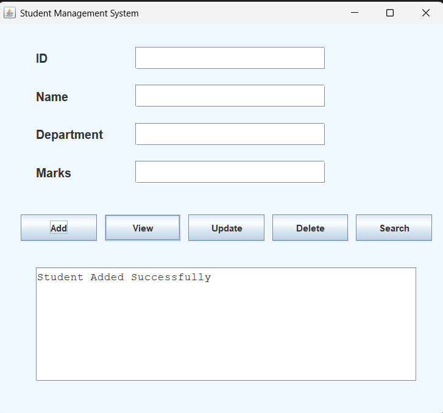
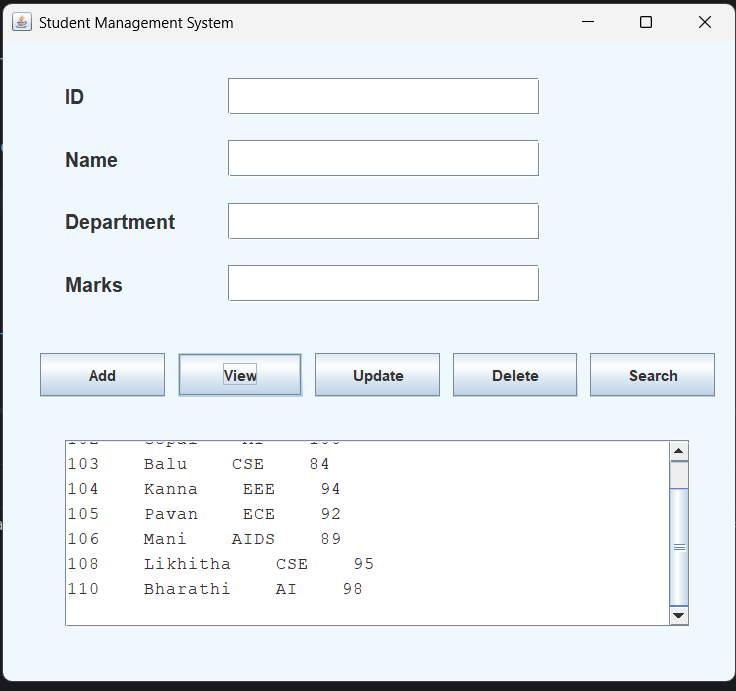

# Student Management System

A GUI-based CRUD application developed using Java, JDBC, MySQL, and Java Swing for managing student records.

---

# Features

- Add Student
- View Students
- Update Student
- Delete Student
- Search Student
- Duplicate ID Validation
- Marks Validation
- Scrollable Output Area
- Professional GUI Interface

---

# Technologies Used

- Java
- JDBC
- MySQL
- SQL
- Java Swing
- IntelliJ IDEA

---

# Project Structure

```text
StudentManagementSystem
│
├── outputs
│   ├── entering-details.png
│   ├── student-added.png
│   └── viewing-records.png
│
├── src
│   ├── DBConnection.java
│   ├── Student.java
│   ├── StudentDAO.java
│   ├── Main.java
│   └── StudentGUI.java
│
├── README.md
└── .gitignore
```

---

# Database Setup

Run the following SQL queries in MySQL Workbench:

```sql
CREATE DATABASE studentdb;

USE studentdb;

CREATE TABLE students (
    id INT PRIMARY KEY,
    name VARCHAR(100),
    department VARCHAR(50),
    marks INT
);
```

---

# JDBC Connection

```java
DriverManager.getConnection(
    "jdbc:mysql://localhost:3306/studentdb",
    "root",
    "your_password");
```

---

# GUI Features

- User-friendly Java Swing interface
- CRUD operations using buttons
- Scrollable output display
- Input validation
- Database integration using JDBC

---

# CRUD Operations Implemented

| Operation | SQL Query |
|---|---|
| Create | INSERT INTO students |
| Read | SELECT * FROM students |
| Update | UPDATE students SET |
| Delete | DELETE FROM students |
| Search | SELECT * FROM students WHERE id=? |

---

# Concepts Used

- Object-Oriented Programming
- JDBC Connectivity
- SQL Queries
- PreparedStatement
- ResultSet
- Exception Handling
- Java Swing GUI
- Event Handling

---

# How to Run the Project

1. Install Java JDK 21
2. Install MySQL Server and MySQL Workbench
3. Create the database using the SQL queries provided
4. Add MySQL JDBC Connector JAR file to the project
5. Open the project in IntelliJ IDEA
6. Run `StudentGUI.java`

---

# Requirements

- Java JDK 21
- MySQL Server 8+
- IntelliJ IDEA
- MySQL Connector/J

---

# Screenshots

## Entering Student Details


---

## Student Added Successfully



---

## Viewing Student Records



---

# Resume Description

### Student Management System

- Built a CRUD application using Java and MySQL with JDBC for database connectivity.
- Implemented Create, Read, Update, Delete, and Search operations using SQL queries and PreparedStatement.
- Designed modules for student record management, validation, and database operations.
- Developed a GUI-based interface using Java Swing for managing student information.

---

# Future Enhancements

- Spring Boot Integration
- REST APIs
- Login Authentication
- JTable Integration
- Full Stack Web Version
- Bootstrap UI

---

# Author

Guru Chandrayudu